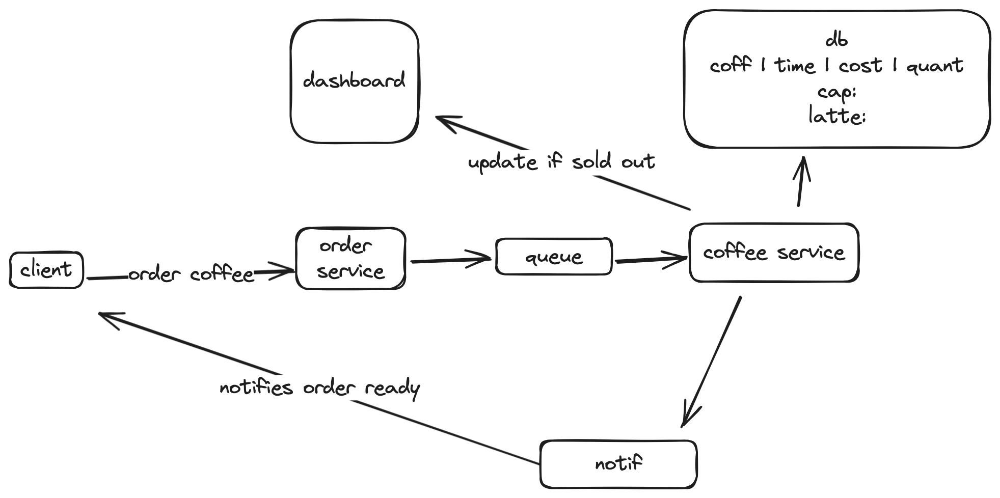

# Barista Order Service


## Get Started
```
cp .env.example .env
make dev  # starts postgres, order-service in docker compose
```

```
# Run app locally
poetry install
poetry run uvicorn --app-dir=order-service main:app --reload
```


